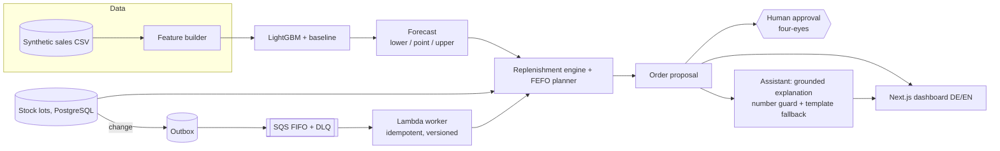

# Architecture diagram

```mermaid
flowchart LR
  subgraph Data
    S[(Synthetic sales CSV)] --> F[Feature builder]
  end
  F --> M[LightGBM + baseline]
  M --> D[Forecast<br/>lower / point / upper]
  D --> R[Replenishment engine + FEFO planner]
  L[(Stock lots, PostgreSQL)] --> R
  R --> P[Order proposal]
  P --> A{{Human approval<br/>four-eyes}}
  P --> X[Assistant: grounded explanation<br/>number guard + template fallback]
  L -- change --> O[(Outbox)] --> Q[[SQS FIFO + DLQ]] --> W[Lambda worker<br/>idempotent, versioned]
  W --> R
  P --> UI[Next.js dashboard DE/EN]
  X --> UI
```
The model forecasts; deterministic code decides the quantity; a person approves.
Cloud parts (SQS, Lambda, RDS, Bedrock) are defined in CDK and tested but not deployed.
